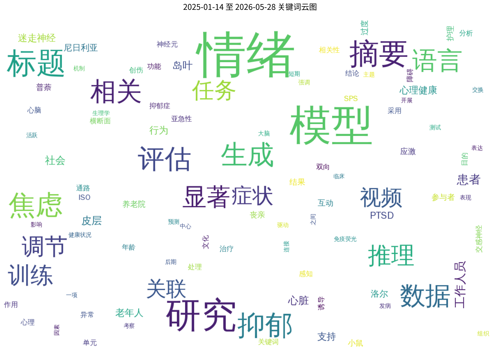
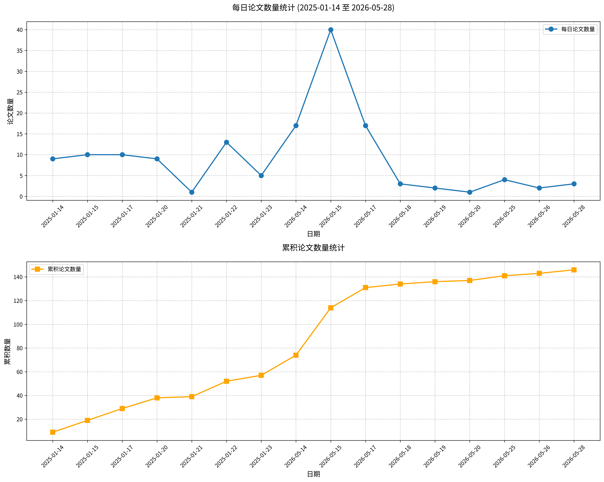

# 心理学相关论文日报 (2026-05-30)

## 📊 今日论文统计
- 总论文数：1
- 热门领域：综合领域

## 📝 论文详情

### 1. 空气污染物细颗粒物（PM2.5）暴露轻微增强高脂饮食诱导的雌性大鼠焦虑样行为并损害脑部氧化还原平衡

**原文标题：** The exposure to the air pollutant fine particulate matter (PM2.5) slightly enhances high-fat diet-induced anxiety-like behavior and impairs brain redox balance in female rats.

**摘要：**
引言：肥胖是情绪障碍的主要风险因素。此外，污染物细颗粒物（PM2.5）对中枢神经系统的影响尚需阐明。目的：评估PM2.5是否会增强肥胖的神经心理和氧化效应。方法：雌性Wistar大鼠接受高脂饮食或标准饮食自由摄食24周，并每日通过鼻内滴注暴露于250 µg PM2.5或生理盐水（50 µL）。在最后两天，动物进行旷场实验和高架十字迷宫测试。收集脑结构用于氧化应激评估。结果：高脂饮食和PM2.5对焦虑样行为具有独立和累积效应。高脂饮食减少了旷场中的探索行为，而PM2.5增加了在高架十字迷宫闭臂中的停留时间。此外，暴露于污染物的动物对饮食减少站立频率的效应更为敏感，提示存在细微的累积效应。暴露于PM2.5的肥胖大鼠海马中脂质过氧化水平升高。相反，高脂饮食减少了皮层中的脂质过氧化和超氧化物歧化酶防御，而PM2.5主要影响小脑的抗氧化防御。结论：PM2.5和肥胖具有独立效应，它们的联合作用增加了彼此在神经行为和氧化影响方面的脆弱性。

**关键词：** PM2.5；焦虑样行为；高脂饮食；氧化应激；情绪障碍

**论文链接：** [PubMed](https://pubmed.ncbi.nlm.nih.gov/41962857/)

---

## 🔍 关键词云图

## 📈 近期论文趋势

## 🎙️ 语音播报
- [收听今日论文解读](../audio/2026-05-30_daily_papers.mp3)