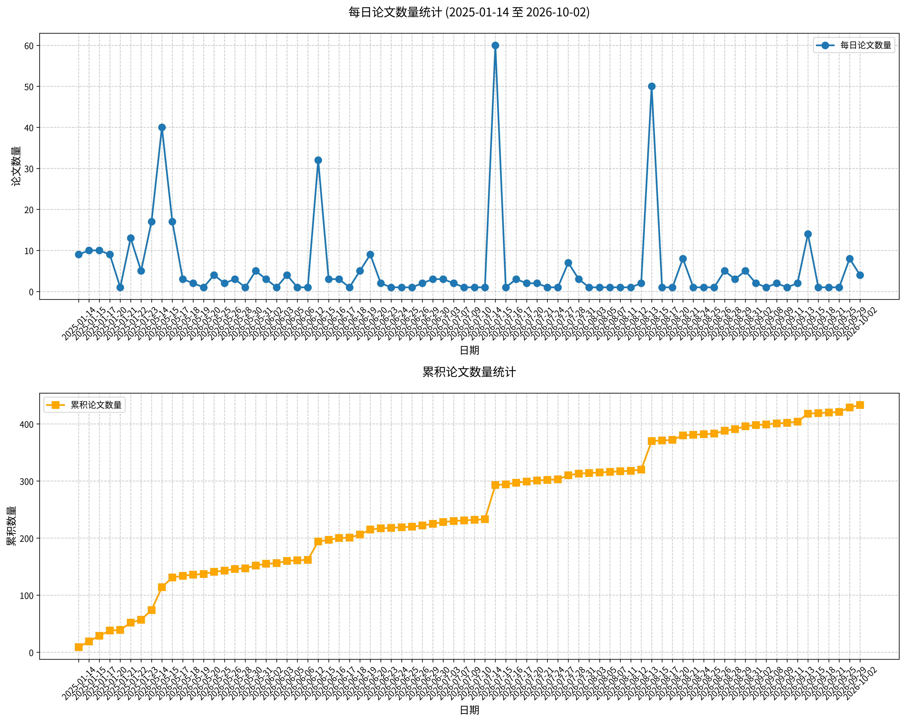

# 心理学相关论文日报 (2026-10-02)

## 📊 今日论文统计
- 总论文数：4
- 热门领域：综合领域

## 📝 论文详情

### 1. 早期出生后多巴胺转运体（DAT）抑制对孤独症大鼠模型社会与认知行为的影响

**原文标题：** Effects of early postnatal dopamine transporter (DAT) inhibition on social and cognitive behavior in a rat model of autism.

**摘要：**
孤独症谱系障碍（ASD）是一种以社会行为和认知缺陷为特征的神经发育障碍。越来越多的证据表明，多巴胺能神经传递的改变，包括多巴胺转运体（DAT）功能的变化，可能参与ASD相关行为异常。本研究探讨了早期出生后发育阶段选择性DAT抑制是否影响由产前丙戊酸钠（NaVP）暴露诱导的ASD大鼠模型中的行为和分子改变。妊娠Wistar大鼠在妊娠第12.5天接受NaVP（600 mg/kg，腹腔注射）。雄性后代从出生后第10天至第23天（PND10-23）每日一次接受选择性DAT抑制剂CE-123（10 mg/kg，腹腔注射）。在青春期（PND25-42）进行行为评估，评价社会互动、识别记忆、空间偏好、焦虑样行为、运动活动和厌恶记忆。在选定脑区评估DAT、多巴胺D2受体、脑源性神经营养因子（BDNF）和白细胞介素-1β（IL-1β）蛋白表达。产前NaVP暴露损害了社会新异性辨别、陈述性记忆、空间记忆和厌恶记忆，降低了运动活动，并增加了焦虑样行为。这些行为改变伴随DAT和多巴胺D2受体表达升高。早期出生后CE-123治疗减轻了若干ASD样行为异常，使DAT和多巴胺D2受体表达正常化，增加了前额叶皮层（PFC）中的BDNF水平，并增加了IL-1β表达，且未诱导非特异性运动刺激。总之，这些发现表明，早期出生后CE-123治疗与持久的行为改善相关，并伴随多巴胺能标志物和BDNF表达的改变。尽管这些发现支持多巴胺能调节和神经可塑性在所观察行为效应中的作用，但其潜在机制仍需进一步研究。

**关键词：** 孤独症谱系障碍；多巴胺转运体；社会行为；认知行为；神经可塑性

**论文链接：** [PubMed](https://pubmed.ncbi.nlm.nih.gov/42501761/)

---

### 2. 解析自闭症中的振荡与非周期性神经活动：神经反馈干预的频谱参数化分析

**原文标题：** Disentangling oscillatory and aperiodic neural activity in autism: A spectral parameterization analysis of neurofeedback intervention.

**摘要：**
背景：自闭症谱系障碍（ASD）以神经振荡异常及兴奋/抑制（E/I）平衡的异质性改变为特征，其方向性因个体、神经回路和发育阶段而异。尽管Alpha波段神经反馈（NFB）是一种有前景的干预手段，但其潜在的神经生理机制尚不清楚，部分原因在于传统EEG分析中周期性信号与非周期性信号的混淆。方法：本随机对照试验招募了40名ASD儿童，分配至实验组（Alpha训练NFB）或无反馈组。干预前后采集静息态EEG和行为评估（SRS、ABC）。我们采用频谱参数化方法将神经活动分解为非周期性成分（1/f斜率、偏移量）和周期性成分（周期性Alpha功率、中心频率）。结果：NFB训练在社会认知和人际交往技能方面产生了显著的行为改善。在生理层面，实验组表现出非周期性斜率的显著陡峭化（指数增加），反映了神经噪声的减少和抑制性调制可能的优化。此外，我们观察到周期性Alpha功率增强和Alpha中心频率（ACF）加速，表明神经效率提高和成熟化。额叶和枕叶区域的这些生理变化与行为评分的改善显著相关。结论：Alpha训练NFB与ASD儿童照护者评定行为评分的改善及静息态EEG频谱特征的调制相关。这些发现验证了频谱参数化标记在评估神经调控干预中的效用。

**关键词：** 自闭症谱系障碍；神经反馈；频谱参数化；Alpha振荡；社会认知

**论文链接：** [PubMed](https://pubmed.ncbi.nlm.nih.gov/42492845/)

---

### 3. 产前暴露于高分子量而非低分子量poly(I:C)导致子代选择性社交能力缺陷

**原文标题：** Prenatal exposure to high- but not low-molecular-weight poly(I:C) produces selective sociability deficits in offspring.

**摘要：**
母体免疫激活（MIA）后出现的社交缺陷被广泛用于建立产前炎症对自闭症谱系障碍（ASD）影响的模型。由于对聚肌苷酸-聚胞苷酸（poly(I:C)）的免疫应答取决于其分子量，我们假设poly(I:C)的分子组成塑造了子代社交缺陷的出现。怀孕Wistar大鼠在妊娠第14天接受单次皮下注射低分子量或高分子量poly(I:C)（LMW或HMW；10 mg/kg）。对两种性别的子代在生命早期和成年期分别采用归巢反应和社交互动测试评估社交行为。旷场和高架十字迷宫任务用于控制运动活动和焦虑样行为。数据采用嵌套线性混合模型分析，并考虑窝仔和队列效应。HMW而非LMW poly(I:C)显著损害了新生儿归巢反应，表明母性依恋的早期破坏。在成年期，暴露于HMW的两种性别子代均表现出社交探究减少，其中雄性还表现出社交接近增加。此外，暴露于HMW和LMW的雄性均表现出运动过度和旷场中央区域停留时间增加，但不伴随焦虑样行为的改变。总之，尽管暴露于HMW和LMW的子代均表现出基础活动改变，但只有HMW poly(I:C)产生了早期社交交流和成年社交行为的显著缺陷。这些发现确定分子量是MIA模型结果的关键决定因素，并支持HMW poly(I:C)作为模拟ASD相关产前免疫挑战的更可靠且更具转化效度的制剂。

**关键词：** 母体免疫激活；poly(I:C)；社交缺陷；自闭症谱系障碍；分子量

**论文链接：** [PubMed](https://pubmed.ncbi.nlm.nih.gov/42398543/)

---

### 4. 帕金森病中保留的目光线索效应：社会性与非社会性注意定向的差异性时间调制

**原文标题：** Preserved gaze cueing in Parkinson's disease: Differential temporal modulation of social and non-social attentional orienting.

**摘要：**
帕金森病（PD）与社会认知受损有关，但社会注意的基本机制是否也受到影响尚不清楚。本研究采用空间线索任务并结合手动反应，考察了帕金森病患者与健康老年人在社会性（目光）和非社会性（箭头）线索下的注意定向。实验操纵了线索有效性（有效 vs. 无效）和刺激呈现不同步时间（100 vs. 300 ms）。结果发现，目光和箭头线索在两组被试中均引发了可靠的线索效应，未发现帕金森病导致注意定向减弱的证据。线索效应的时间进程因线索类型而异：箭头线索引发的定向在较长间隔下增强，而目光线索效应则相对稳定。这一模式在两组中均被观察到，并且对年龄、教育程度和IQ的个体差异具有稳健性。这些结果表明，基本的目光触发注意定向在帕金森病中得以保留，并提示尽管高级社会认知存在受损报道，社会注意机制可能仍然完整。

**关键词：** 帕金森病；社会注意；目光线索效应；注意定向；社会认知

**论文链接：** [PubMed](https://pubmed.ncbi.nlm.nih.gov/42361861/)

---

## 🔍 关键词云图

## 📈 近期论文趋势

## 🎙️ 语音播报
- [收听今日论文解读](../audio/2026-10-02_daily_papers.mp3)